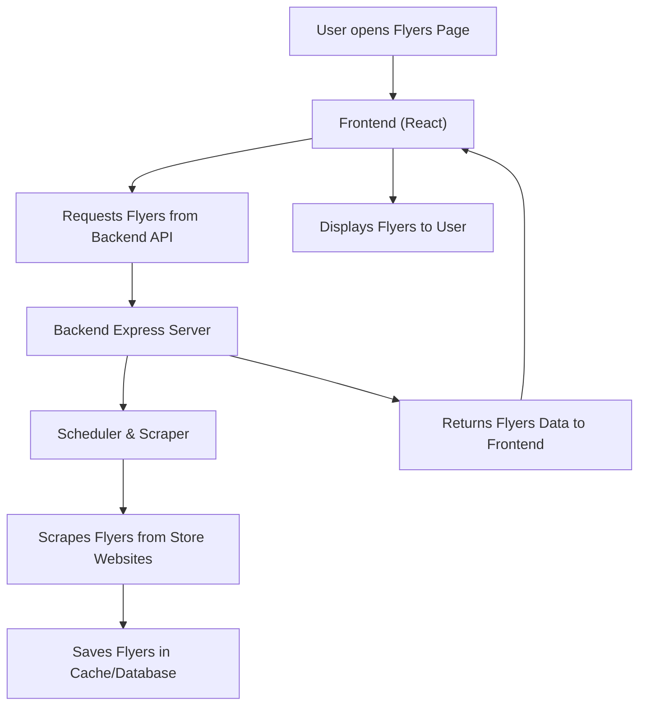

# Flyers Feature Documentation

## What Are "Flyers"?

**Flyers** are digital banners or promotional images from various retail stores (like Croma, Lulu Mall, Sarath City, DMart, and Jewellery stores) that are fetched from their websites and displayed in your application for users to browse.

---

## How Does the Flyers System Work?

### Overview Diagram

---

### Step-by-Step Explanation

#### 1. User Interaction (Frontend)
- The user visits a flyers page (e.g., `/flyers/croma`, `/flyers/lulu`, etc.) in the web app.
- The frontend (React) sends a request to the backend to get the latest flyers.

#### 2. Backend API (Express)
- The backend has routes like `/api/flyers/croma`, `/api/flyers/lulu`, etc. (see `flyerRoutes.js`).
- Each route is connected to a controller that knows how to fetch or serve the right flyers.

#### 3. Scrapers & Schedulers
- **Scrapers** (like `dmartScraper.js`, `flyerScraper.js`, `jewelleryScraper.js`) are scripts that visit the store's website and collect flyer images.
- **Schedulers** (like `flyerScheduler.js`, `dmartScheduler.js`, `jewelleryScheduler.js`) run these scrapers regularly (e.g., every few hours) to keep the flyers up to date.

#### 4. Data Storage
- The scraped flyers are stored in a cache or database for quick access.

#### 5. Serving Flyers
- When the frontend requests flyers, the backend quickly returns the latest cached flyers.

#### 6. Display
- The frontend receives the flyer data and displays the images in a user-friendly way.

---

## Key Files and Their Roles

| File/Folder | What It Does |
|-------------|--------------|
| **/controllers/flyer/flyerController.js** | Handles requests for general flyers (Croma, Lulu, Sarath City, etc.) |
| **/controllers/flyer/dmartController.js** | Handles DMart-specific flyer requests |
| **/controllers/flyer/jewelleryController.js** | Handles Jewellery-specific flyer requests |
| **/routes/flyerRoutes.js** | Defines all flyer-related API endpoints |
| **/scrapers/dmartScraper.js** | Scrapes DMart website for banner images |
| **/scrapers/flyerScraper.js** | Scrapes Croma, Lulu, Sarath City, etc. for flyers |
| **/scrapers/jewelleryScraper.js** | Scrapes Jewellery website for banners |
| **/schedulers/flyerScheduler.js** | Schedules regular scraping for general flyers |
| **/schedulers/dmartScheduler.js** | Schedules regular scraping for DMart banners |
| **/schedulers/jewelleryScheduler.js** | Schedules regular scraping for Jewellery banners |
| **/index.js** | Main backend entry point; sets up routes and starts schedulers |
| **/src/Components/Flyers/** | Frontend React components for displaying flyers |
| **Routess.tsx** | Frontend routing; maps URLs to flyer pages |

---

## Example: How a Flyer Gets to the User

1. **Scheduler** runs every few hours, triggers the **scraper** for Croma.
2. **Scraper** visits Croma's website, collects flyer images, and saves them.
3. User visits `/flyers/croma` in the app.
4. Frontend sends a request to `/api/flyers/croma`.
5. Backend returns the latest Croma flyers.
6. Frontend displays the flyers to the user.

---

## Summary: What Am I Doing?

- Building a system to automatically fetch, store, and display promotional flyers from popular retail stores.
- Using backend scrapers and schedulers to keep the flyers up to date.
- Providing a user-friendly frontend for users to browse the latest offers and banners.

---

## How to Use This Documentation

- **For Presentations:**
  - You can convert this Markdown file to PDF using tools like VSCode extensions, online Markdown-to-PDF converters, or `pandoc`.
  - The diagram is in Mermaid format and can be rendered in compatible Markdown viewers or exported as an image for slides.
- **For Team Members:**
  - Share this file to help new developers or non-technical stakeholders understand the flyers system.

---

*Prepared for: Project Presentation / Team Onboarding* 